*Student name: Ting Li; Duo Xu*

*Travel day usage: 2 totally, and 1 day per person*

**## Description of Project:**

This project explores how deep learning models recognize digits and fashion items using the MNIST and Fashion-MNIST datasets. In **Task 1**, we built and trained a simple CNN to recognize hand-written digits, tested it on both standard and custom digits, and analyzed its predictions. In **Task 2**, we visualized what the network learns in the early layers. In **Task 3**, we applied transfer learning by fine-tuning the MNIST model to classify three Greek letter (alpha, beta, gamma), using both small(~9 per letter) and big training datasets(~70 per letter). In **Task 4**, we tested how changing CNN structure, like the number of filters, dense nodes, and dropout rate affects model performance. We trained 64 combinations automatically and analyzed accuracy, training time, and loss. Finally, in the **Extension**, we replaced the first CNN layer with fixed Gabor filters.

**## Task 1.**
### A. 
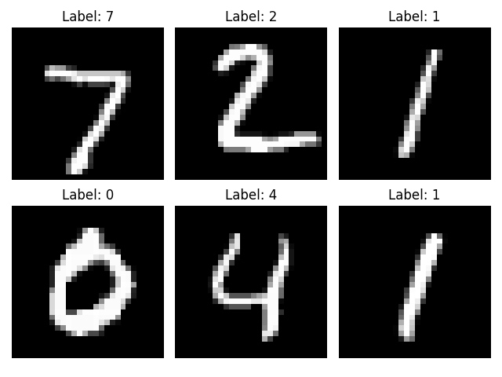
Shows the first six MNIST test images used to evaluate the trained digit classifier. 

### B.
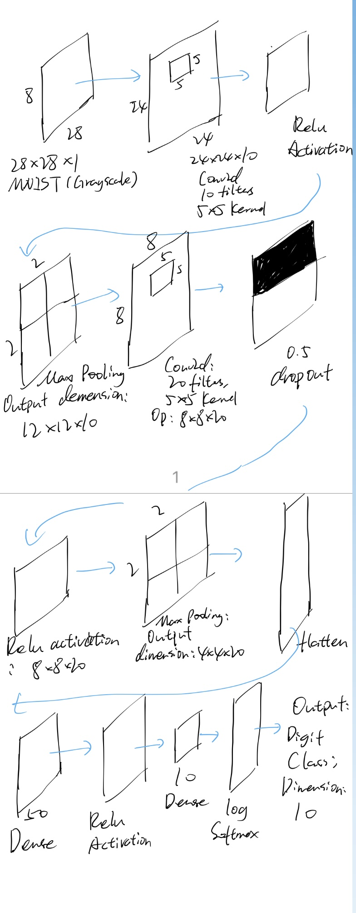
Visualizing the architecture of our convolutional neural network used for MNIST digit recognition.

### C.
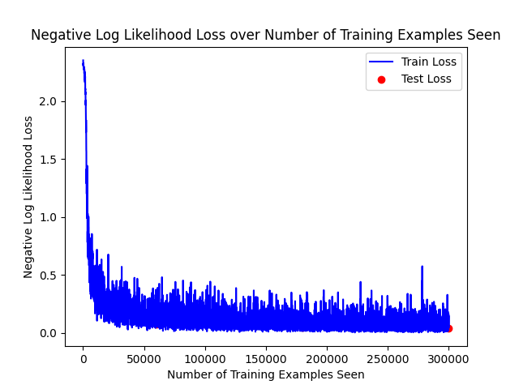
Plots training loss over five epochs, showing how the model learns over time.

### E.
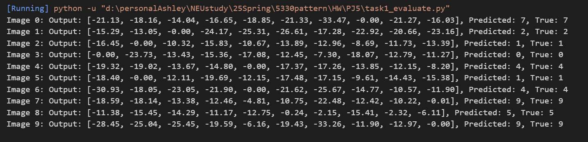
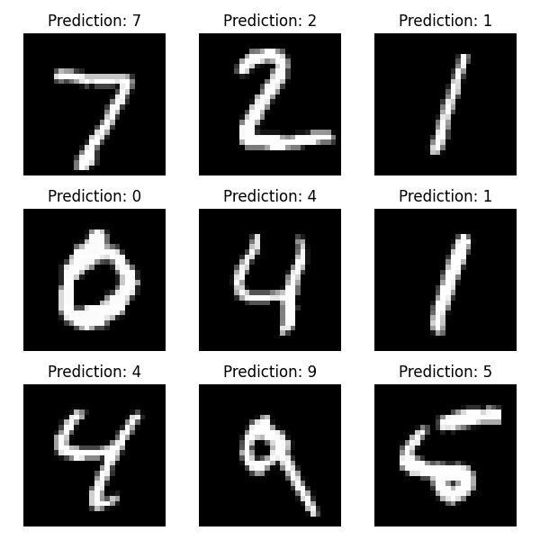
Demonstrates predictions for ten random MNIST test digits with their actual values.

### F.
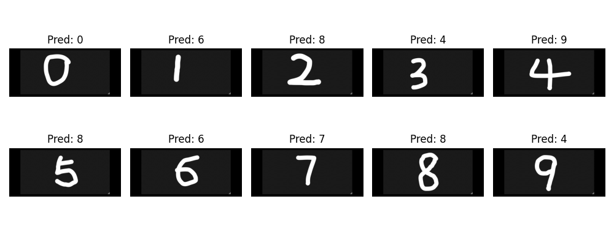
From above, we can tell that hand-written digit 1, 2, 3, 4, 5 are not correctly predicted, while the rest digits are correctly predicted. We think the reason might be those letters not fit in MNIST digits' standard.

**## Task 2.**
### A.
We think it looks like Sobel (edge detect filter) since we can see high contrast in one direction.
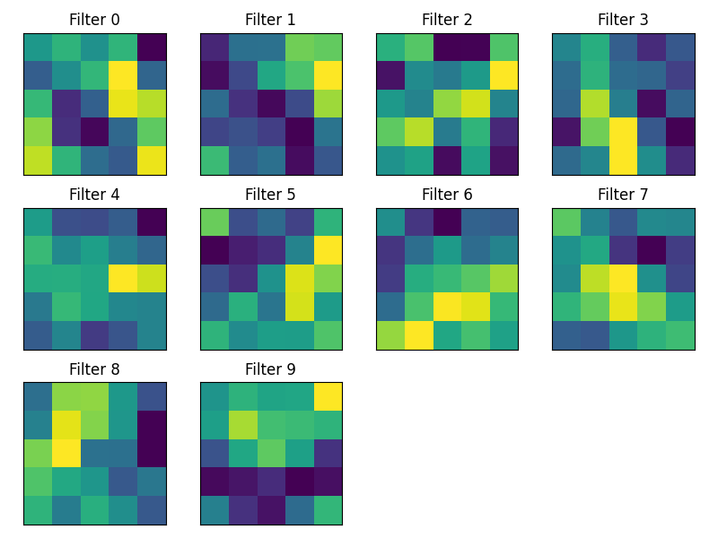

### B.
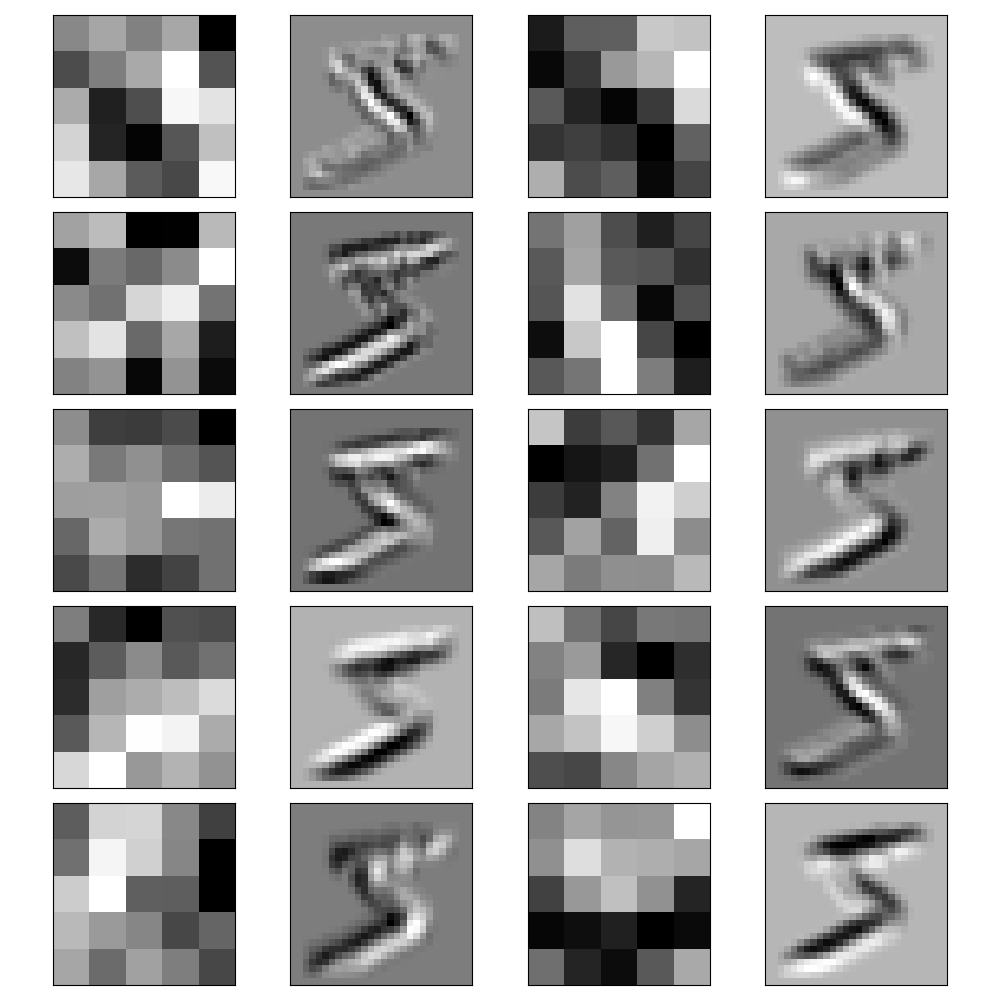
We think the result makes sense. The filters learned by the network respond to parts of the digit that match their shape, like edges or curves. 

**## Task 3.**
### Train result of greek_train file:
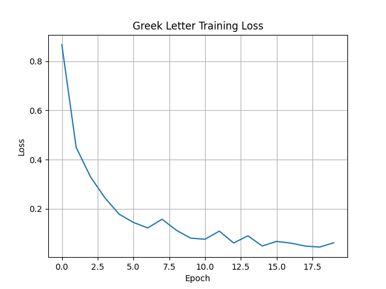
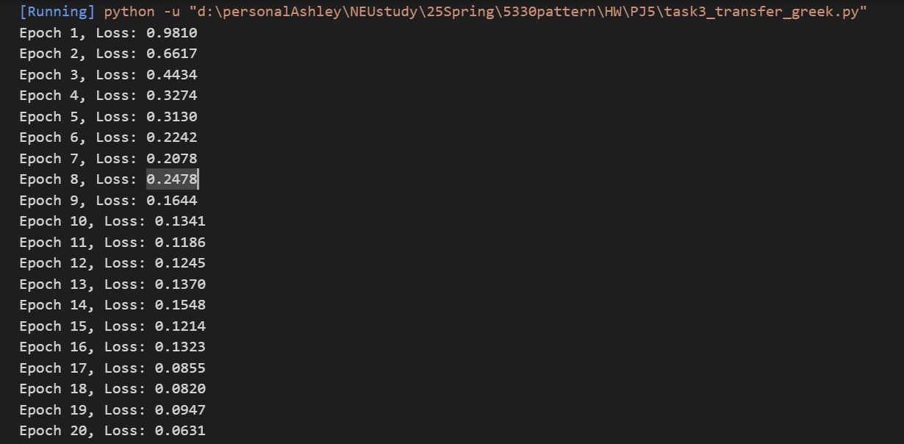
From above two picture, we think the number of epoch should be at least of more than 10 (loss hence < 0.15). 

### Test result of self-handwritten greek letters based on small and addition(big) images trained:

From above image, we can see 5 out of 9 letters could be correctly identified, which is one alpha, one beta and all three gamma. 

Besides, we continued to train a model still for these three letters using about 70 images per letter from addition folder's images. These images were processed to match the MNIST digit style and used to fine-tune a pre-trained MNIST model. However, the final test results were not ideal, only the handwritten gamma letters were predicted correctly, while most alpha and beta letters were misclassified, given by the training loss is promising.
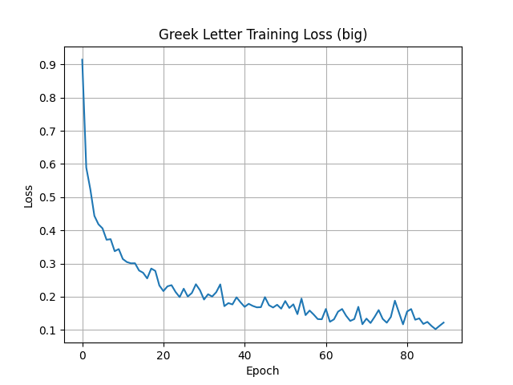
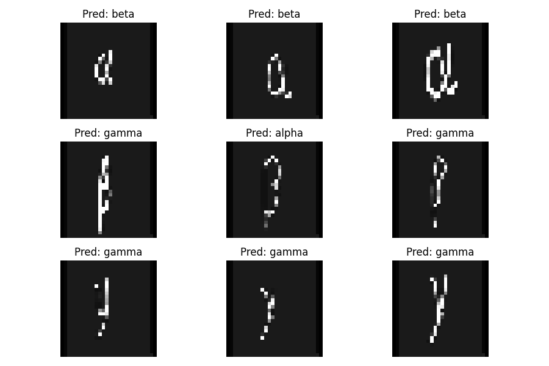
Please see the link of my hand written three greek letter: [one drive link](https://northeastern-my.sharepoint.com/:f:/g/personal/li_ting4_northeastern_edu/Er7PDHAIgUdNjfizZJnAhnwBn1Ur7ByDZfp6gaf8XutOog?e=knJr25)

**## Task 4.**
### A. Plan
We aim to find a good CNN structure for the Fashion-MNIST classification task by experimenting with different network settings. Specifically, we explore three dimensions of the CNN:
1. Number of convolution filters – how many filters are in the convolution layer.
2. Number of fully connected (dense) nodes – how big the fully connected layer is.
3. Dropout rate – how much dropout to apply during training.

We try the following values for each dimension:
- Convolution filters: [5, 10, 20, 30]
- FC nodes: [32, 64, 128, 256]
- Dropout rate: [0.3, 0.5, 0.7, 0.9]

This gives a total of 64 combinations (4 × 4 × 4), and we evaluate all of them automatically using Python.
For each model, we record:
- Test accuracy
- Training time
- Average training loss

We use a linear search approach: for each setting, we hold two parameters constant and vary the third, so we can observe the effect of each change independently.

### B. Predictions
To our best knowledge, we hypothesize that the best model should be: 30 filters, with 128 FC nodes, and dropout rate 0.5.

### C. Plan execution and Hypotheses Evaluation
The best model (see result CSV image below)is the one with 20 convolution filters, 128 FC nodes, and dropout rate 0.3, because it achieves the highest accuracy and lowest loss among all tested configurations. While its training time is a bit longer (around 151s), it's still acceptable compared to others (e.g., 147–150s).
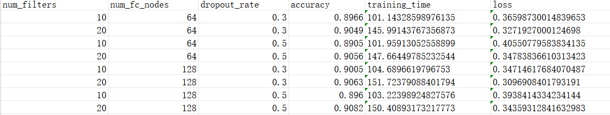

Below are related plots.
- Test accuracy VS three dimensions:
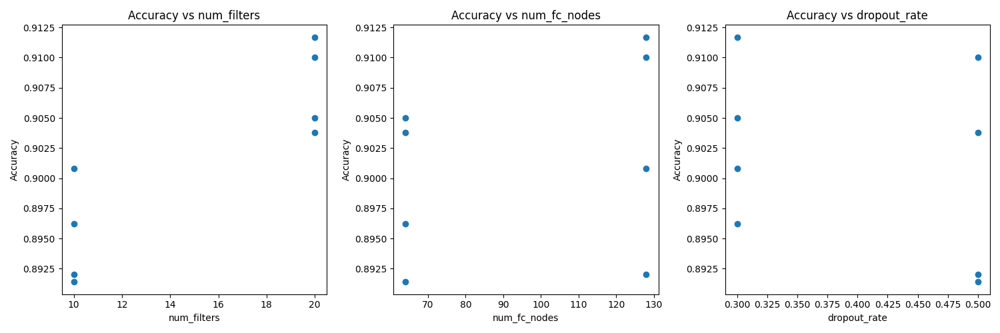

- Training time VS three dimensions:
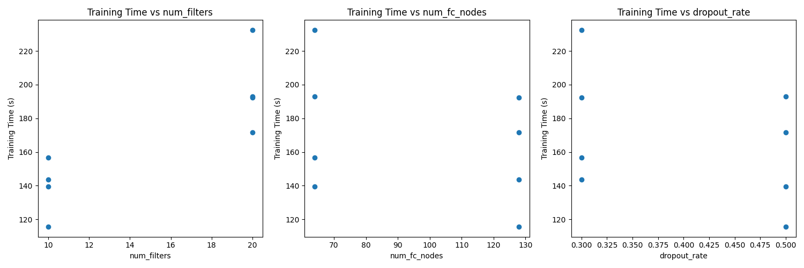

- Average training loss VS three dimensions:
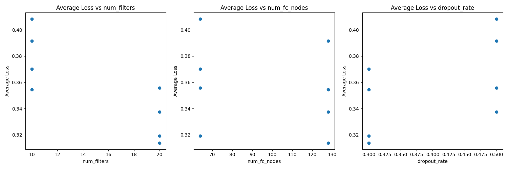

**## Extension.**

Replacing the first convolutional layer with fixed Gabor filters resulted in a test accuracy of **86.81%** (see image below), which is reasonably close to the fully trainable CNN baseline (**~91–92%**)[1].  
This demonstrates that Gabor filters offer a strong starting point for visual recognition tasks, especially in environments with limited data or limited time since we noticed the run time is significantly decreased. 
However, trainable filters is still better.
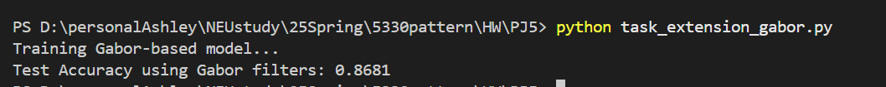

**## Reflection:**

This project gave us a deeper understanding of how convolutional neural networks (CNNs) work. We learned how to build a model, train it, and improve its performance by adjusting layers, filters, and dropout rates. It was interesting to see how small changes in the network could affect both accuracy and training time. Testing with handwritten greek letters showed us the challenges of applying a model to different data, even it looks similar. We also learned how to automate experiments and analyze results using plots. Replacing the first layer with Gabor filters was a new idea for us, and we saw that fixed filters can still perform quite well. Overall, we gained useful experience in model design, training, testing, and evaluation. This project helped build both our technical skills and confidence in working with deep learning models.

**Reference**  
[1] Zalando Research — Fashion-MNIST Dataset. https://github.com/zalandoresearch/fashion-mnist